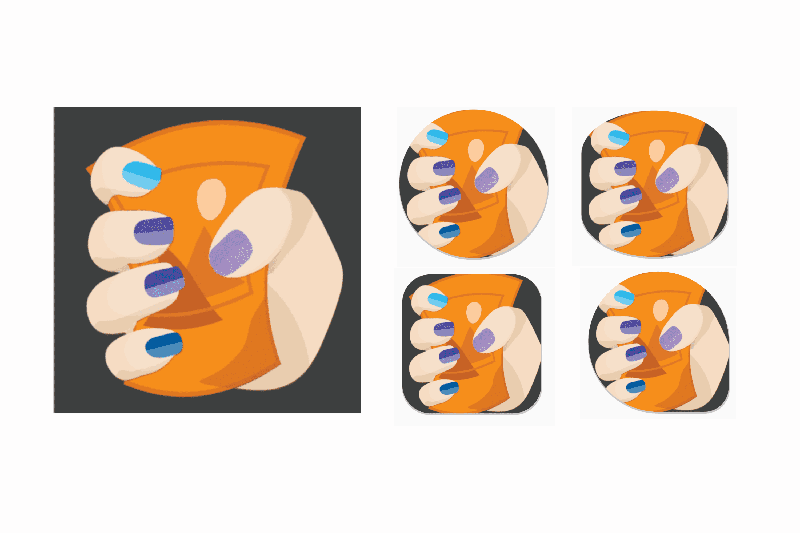

# PWA

# PWA란?

프로그레시브 웹 앱(Progressive Web Apps)

모바일 기기에서 네이티브 앱(Native App)과 같은 사용자 경험을 제공하는 웹 앱

- 웹 브라우저를 통해 앱을 바로 사용할 수 있다.
- 오프라인에서도 작동 가능
    - 웹 페이지가 로딩되는 동안 오프라인에서 캐시된 데이터를 사용할 수 있고, 네트워크 연결이 되면 새로운 데이터를 불러와 업데이트를 할 수 있다

# 예시

- GitHub
- Youtube
- Youtube Music
- Disney plus

# **PWA 체크리스트 (핵심 요구**사항)

- 빠른 부팅, 빠른 사용
- 모든 브라우저에서 작동
- 모든 화면 크기에서 작동
- 맞춤 오프라인 페이지 제공
- 설치 가능

# 장점

- 네이티브 앱을 공부하지 않아도 유사한 수준으로 개발 가능
    - 일반적으로 개발 비용이 더 저렴하다.
- 다양한 앱스토어에 출시하기 위해서 별도의 프로세스를 거치지 않아도 된다. (스토어에 배포 안 한다고 가정했을 때)
- 기존의 웹사이트를 앱으로 만들 수 있기 때문에, 추가로 유지관리해야 하는 코드베이스(codebase, 소스코드 일체)가 적다.
- PWA는 기본적으로 반응형(responsive)이기 때문에, 다양한 화면 크기에도 잘 동작한다.
- PWA는 부드럽고 빠르며 가볍다.
- 일반적인 웹사이트와는 달리, 오프라인에서도 작동한다.
- PWA는 검색엔진을 통해서 찾을 수 있다. (앱스토어보다는 검색엔진을 사용하는 사람들이 훨씬 더 많다. 그리고 원한다면 앱스토어를 통해서도 PWA를 배포할 수 있다.)
    - 네이티브앱은 앱스토어 최적화(ASO), PWA는 검색엔진최적화(SEO)
- 푸시 알림을 통해서 사용자들의 관심을 끌 수 있다.

# manifest.json

```json
{
  "short_name": "Weather",
  "name": "Weather: Do I need an umbrella?",
  "icons": [
    {
      "src": "/images/icons-vector.svg",
      "type": "image/svg+xml",
      "sizes": "512x512"
    },
    {
      "src": "/images/icons-192.png",
      "type": "image/png",
      "sizes": "192x192"
    },
    {
      "src": "/images/icons-512.png",
      "type": "image/png",
      "sizes": "512x512"
    }
  ],
  "id": "/?source=pwa",
  "start_url": "/?source=pwa",
  "background_color": "#3367D6",
  "display": "standalone",
  "scope": "/",
  "theme_color": "#3367D6",
  "shortcuts": [
    {
      "name": "How's weather today?",
      "short_name": "Today",
      "description": "View weather information for today",
      "url": "/today?source=pwa",
      "icons": [{ "src": "/images/today.png", "sizes": "192x192" }]
    },
    {
      "name": "How's weather tomorrow?",
      "short_name": "Tomorrow",
      "description": "View weather information for tomorrow",
      "url": "/tomorrow?source=pwa",
      "icons": [{ "src": "/images/tomorrow.png", "sizes": "192x192" }]
    }
  ],
  "description": "Weather forecast information",
  "screenshots": [
    {
      "src": "/images/screenshot1.png",
      "type": "image/png",
      "sizes": "540x720",
      "form_factor": "narrow"
    },
    {
      "src": "/images/screenshot2.jpg",
      "type": "image/jpg",
      "sizes": "720x540",
      "form_factor": "wide"
    }
  ]
}
```

- [https://web.dev/articles/add-manifest](https://web.dev/articles/add-manifest)

## `short_name` / `name`

```json
"short_name": "Weather",
"name": "Weather: Do I need an umbrella?",
```

- `short_name`
    - 사용자의 홈화면, 런처 또는 공간이 제한될 수 있는 다른 위치에서 사용
- `name`
    - 앱이 설치될 때 사용
- **최소한 둘 중 하나 제공 필수**

## `description`

- 앱의 목적을 설명

## `icons`

```json
"icons": [
    …
    {
      "src": "path/to/regular_icon.png",
      "sizes": "196x196",
      "type": "image/png",
      "purpose": "any"
    },
    {
      "src": "path/to/maskable_icon.png",
      "sizes": "196x196",
      "type": "image/png",
      "purpose": "maskable" // <-- New property value `"maskable"`
    },
    …
  ],
```

- 사용자가 PWA를 설치할 때 홈 화면, 앱 런처, 작업 전환기, 스플래시 화면 등에서 사용할 브라우저의 아이콘 집합
- [maskable icon](https://web.dev/articles/maskable-icon?hl=ko)
    - `"purpose": "maskable"` | `“any maskable”` 추가
    - 일부 운영체제(Android)에서는 다양한 크기와 모양에 맞게 아이콘을 조정
    - 기본 아이콘이 '안전 영역' 내에 포함된 정사각형 이미지 파일을 제공해야 함.
    - 마스크 가능한 아이콘은 최소한 512x512 여야 한다.
    - [Maskable.app](https://maskable.app/) - maskable icon 생성 도구
        
        
        
        아이콘 조정 예시
        
        
        
        안전 영역
        
- Next.js app router favicon, icon, apple-icon 파일 컨벤션 존재
    
    [Metadata Files: favicon, icon, and apple-icon](https://nextjs.org/docs/app/api-reference/file-conventions/metadata/app-icons)
    

## `start_url`

```json
"start_url": "/home",
```

- **필수 항목**⭐
- 애플리케이션이 시작될 때 애플리케이션을 시작할 위치를 브라우저에 알려줌
- 사용자가 앱을 홈화면에 추가할 때 어느 페이지에서나 앱이 시작되지 않도록 함

## `theme_color`


- 데스크톱의 창 **제목표시줄** 색상과 휴대기기의 **상태표시줄** 색상을 정의
- 미디어 쿼리(`prefers-color-scheme`)를 통해 다크모드 / 라이트모드 별도로 설정 가능
- `theme_color`은 문서 헤드에 지정된 `meta` 테마 색상과 일치해야 함
    
    ```html
    <head>
        <meta name="theme-color" content="#001529" />
    </head>
    ```
    

<aside>
💡 **참고:** 프로그레시브 웹 앱 사용자 인터페이스를 계획할 때 테마에 이미지나 그라데이션을 사용할 수 없으며 단색만 사용해야 합니다. 투명하지 않은 색상을 선택하고 **`rgb`** 또는 **`hsl`** 색상, 16진수 코드 또는 이름이 지정된 색상을 사용하는 것이 가장 좋습니다. 앱 테마를 설정하면 **`[<meta name="theme-color">](https://web.dev/articles/add-manifest?hl=ko#theme-color)`** 요소를 사용할 때와 같이 앱을 설치하지 않고도 브라우저 테마 설정에 영향을 미칠 수 있습니다.

</aside>

## **`background_color`**

```json
"background_color": "#3367D6",
```

- 앱과 해당 CSS가 로드되기 전 창의 색상을 정의
- 브라우저에서 첫 번째 페인트가 끝날 때까지 스플래시 화면을 표시
    - 다음과 같이 매니페스트 속성에서 자동으로 스플래시 화면을 만든다
        - `name`
        - `background_color`
        - `icons`
        
        
        
    - [IOS에서의 스플래시 화면](https://web.dev/learn/pwa/enhancements?hl=ko#splash_screens)

## `display`

```json
"display": "standalone",
```

원하는 창 환경의 종류를 정의

- `fullscreen`
    - 브라우저 UI(상태 표시줄과 탐색 메뉴)없이 웹 애플리케이션을 열고 사용 가능한 디스플레이 영역 전체를 차지
    - 전체 화면 환경은 게임, VR, AR 환경과 같은 몰입형 환경에 적합
    - Android ✅
    - 데스크톱, IOS ❌
        - PWA 내에서 [Fullscreen API](https://developer.mozilla.org/docs/Web/API/Fullscreen_API)를 사용하여 사용자의 요청에 따라 앱을 전체 화면으로 표시할 수 있습니다.
- `standalone`
    
    
    
    - 웹 앱을 열어 독립형 앱처럼 보이도록 합니다. 앱은 브라우저와 분리된 자체 창에서 실행되며 URL 표시줄과 같은 표준 브라우저 UI 요소를 숨깁니다.
- `minimal-ui`
    
    
    
    - standalone와 유사하지만 사용자에게 탐색 (예: 뒤로 및 새로고침)을 제어하기 위한 최소한의 UI 요소 집합을 제공합니다.
    - Android, 데스크톱 ✅
- `browser(default)`
    - 표준 브라우저 환경

<aside>
💡 **fallback display mode
기본값 :** `fullscreen` → `standalone` → `minimal-ui` → `browser` 

`disaplay_override` 속성을 통해 사용자가 fallback chain을 설정할 수 있다.

```json
{
  "display_override": ["window-control-overlay", "minimal-ui"],
  "display": "standalone",
}
```

</aside>

### 참고) display mode와 관련한 미디어쿼리 문법

```css
/* It targets only the app used within the browser */
@media (display-mode: browser) {
}
/* It targets only the app used with a system icon in standalone mode */
@media (display-mode: standalone) {
}
/* It targets only the app used with a system icon in all mode */
@media (display-mode: standalone), (display-mode: fullscreen), (display-mode: minimal-ui) {
}
```

## `scope`

```json
"scope": "/",
```

- 브라우저에서 앱 내에 있다고 판단하는 URL 집합을 정의하며, 사용자가 앱을 떠난 시점을 결정하는 데 사용
- 웹 앱의 모든 진입점과 이탈 지점을 포괄하는 URL 구조를 제어
- 범위 밖에 있는 페이지로 연결하면 PWA 창 대신 인앱 브라우저에서 렌더링
- `start_url`는 `scope` 내에 있어야 한다.

## `manifest.json` 웹 페이지에 추가

```json
<link rel="manifest" href="/manifest.json">
```

# 설치

pwa가 설치 기준을 통과하면 브라우저에서 기본 설치 메시지를 제공한다.

- manifest.json의 `name`, `icons` 속성에 따라 기본 설치 메시지가 생성
    
    
    
- 일부 브라우저는 `description`, `categories`, `screenshots` 등 [매니페스트의 프로모션 입력란](https://web.dev/learn/pwa/web-app-manifest?hl=ko#promotional_fields)을 사용하여 설치 메시지 환경을 개선할 수 있다.
- 예를 들어 Android에서 Chrome을 사용할 때 PWA서 `description` 및 `screenshots` 필드의 값을 제공하면 설치 대화상자가 작은 **홈 화면에 추가** 정보 표시줄에서 더 크고 자세한 대화상자로 전환됩니다. 이는 앱 스토어의 설치 메시지와 유사합니다.

## 데스크톱

- Windows PC의 시작 메뉴나 시작 화면, Linux GUI의 도크 또는 데스크톱, macOS 시작점 또는 Chromebook 앱 런처에 아이콘이 있습니다.
    
    
    
- 앱이 활성 상태이거나 최근에 사용되었거나 백그라운드에서 열릴 때 앱 전환기 및 도크에 아이콘이 표시됩니다.
    
    
    
- Windows에서 **검색** 또는 macOS에서 **Spotlight**를 사용하는 등 앱 검색에 표시됩니다.
    
    
    
- 아이콘에 배지 번호를 설정하여 새로운 알림을 표시할 수 있습니다. [Badging API](https://developer.mozilla.org/docs/Web/API/Badging_API)를 사용하면 됩니다.
    
    
    
- [앱 바로가기](https://developer.mozilla.org/docs/Web/Manifest/shortcuts)로 아이콘의 컨텍스트 메뉴를 설정할 수 있습니다.
- 동일한 브라우저로 두 번 설치할 수 없습니다.

## IOS

- 홈 화면, Spotlight의 검색, Siri 추천, 앱 라이브러리 검색에 표시됩니다.
- 앱 갤러리의 카테고리 폴더에는 표시되지 않습니다.
- 배지 설정 및 앱 바로가기와 같은 기능을 지원하지 않습니다.

# 오프라인 지원

- 앱을 오프라인에서 사용할 수 있게 하려면 오프라인 환경에 필요한 애셋을 캐시하고 나중에 서비스 워커가 이러한 애셋을 제공하도록 해야 합니다.
- 오프라인 애셋을 사용하기 전에 캐시에 추가해야 합니다. 이 경우 요청 시 이를 캐시할 수 없습니다.

## 스토리지

- [IndexedDB](https://developer.mozilla.org/docs/Web/API/IndexedDB_API): 구조화된 데이터 및 blob (바이너리 데이터)을 위한 NoSQL 객체 스토리지 옵션입니다.
- WebStorage: 로컬 저장소 또는 세션 저장소를 사용하여 키-값 문자열 쌍을 저장하는 방법입니다. 서비스 워커 컨텍스트 내에서는 사용할 수 없습니다. 이 API는 동기식이므로 복잡한 데이터 저장에는 권장되지 않습니다.
- 캐시 저장소: [캐싱 모듈](https://web.dev/learn/pwa/caching?hl=ko)에서 다룹니다.

# 서비스 워커

- 서비스 워커를 사용하면 네트워크로 이동하지 않고도
    - 에셋을 제공하고,
    - 사용자에게 알림을 보내고,
    - PWA 아이콘에 배지를 추가하고,
    - 백그라운드에서 콘텐츠를 업데이트하고,
    - 전체 PWA가 오프라인으로 작동하도록 할 수 있습니다.


- 앱이 서비스 워커의 범위에 포함되는 리소스를 요청하면 서비스 워커가 **네트워크 프록시 역할**을 하면서 요청을 가로챔.
- 그런 다음 일반적으로 서비스 워커가 없는 경우와 마찬가지로 Cache Storage API를 통해 캐시로부터 리소스를 제공할지, 아니면 로컬 알고리즘에서 리소스를 생성할지 결정할 수 있다.
    - 이를 통해 플랫폼 앱에서 제공하는 것과 유사한 환경을 제공할 수 있으며 완전히 오프라인으로 작동할 수도 있다.
- **일부 브라우저는 서비스 워커를 지원하지 않는다.** 서비스 워커가 표시되더라도 최초 로드 시 또는 활성화 대기 중일 때는 사용할 수 없다. 따라서 **선택사항**으로 취급하고 핵심 기능을 위해 반드시 필요하지는 않다.
- **서비스 워커 등록하기**
    - 서비스 워커를 등록하기 전까지는, 서비스 워커가 아직 페이지를 제어할 수 없기 때문에, 사용자가 처음으로 PWA에 접속하면 네트워크 요청이 여러분의 서버로 직접 이동
    - 브라우저가 Service Worker API를 지원하는지 확인한 후 PWA가 서비스 워커를 등록할 수 있다. 서비스 워커는 로드되면 요청을 가로채고 해당 응답을 제공하는 PWA와 네트워크 사이에 공간을 설정합니다.
        
        ```jsx
        if ('serviceWorker' in navigator) {
           navigator.serviceWorker.register("/serviceworker.js");
        }
        ```
        
- `개발자도구 > application` 탭에서 서비스 워커 활성화 여부 확인 가능

## Android

Android에서는 PWA 설치 메시지가 기기 및 브라우저에 따라 다름

- **WebAPK**
- 바로가기
- QuickApp으로 설치

### WebAPKs

- 일반적으로 클라우드에 있는 사용자 기기의 신뢰할 수 있는 제공업체가 WebAPK *minting 서버*에서 만든 Android 패키지 (APK)
- 대부분의 Android 사용자
    - Google 모바일 서비스 (GMS)가 설치된 기기의 Chrome과 삼성 인터넷 브라우저에서 사용
    - Galaxy 휴대전화 또는 태블릿과 같은 삼성 제조 기기에서만 사용
- WebAPK를 통해 설치된 PWA:
    - 앱 런처와 홈 화면에 아이콘이 있어야 합니다.
    - 설정, 앱에 표시됩니다.
    - [배지](https://web.dev/badging-api?hl=ko), [앱 바로가기](https://web.dev/articles/app-shortcuts?hl=ko), [OS 내 링크 캡처](https://web.dev/declarative-link-capturing?hl=ko)와 같은 여러 기능이 있을 수 있습니다.
    - 아이콘과 앱의 메타데이터를 [업데이트](https://web.dev/manifest-update?hl=ko)할 수 있습니다.
    - 두 번 설치할 수 없습니다.

### 웹 사이트 바로가기

- **WebApk를 만들 수 없는 경우** 웹사이트 바로가기로 생성
- 바로가기로 설치된 PWA:
    - 홈 화면에 **브라우저 배지** 아이콘이 있어야 합니다 (다음 예 참고).
        
        
        
    - 런처나 **설정, 앱**에 아이콘이 없습니다.
    - 설치가 필요한 기능은 사용할 수 없습니다.
    - 아이콘 및 앱 메타데이터를 업데이트할 수 없습니다.
    - 동일한 브라우저를 사용하더라도 여러 번 설치할 수 있습니다. 이 경우 모두 동일한 인스턴스를 가리키고 동일한 스토리지를 사용합니다.

### QuickApps

- Huawei와 ZTE를 비롯한 일부 제조업체

# 스토어 배포

- pwa를 pwa 런처에 래핑하고 구글 플레이 스토어 또는 windows 스토어와 같은 스토어에 업로드할 수 있다.
- **PWA 게시를 지원하는 앱 카탈로그 및 스토어**
    - [Google PlayStore](https://chromeos.dev/en/publish/pwa-in-play)
    - [Apple App Store (App-Bound Domains)](https://webkit.org/blog/10882/app-bound-domains/)
        - [https://docs.pwabuilder.com/#/builder/app-store](https://docs.pwabuilder.com/#/builder/app-store)
    - [Microsoft Store (Windows 10, 11)](https://docs.microsoft.com/en-us/windows/uwp/publish/pwa/overview)
        - [Windows 10 및 11용 Microsoft Store](https://docs.microsoft.com/en-us/windows/uwp/publish/pwa/overview)(APPX 패키지 사용)
    - [삼성 Galaxy Store](https://samsunginternet.github.io/introducing-progressive-web-apps-to-samsung-galaxy-store/): 삼성 WebAPK 발급 서버를 사용합니다.
    - Huawei AppGallery([HTML 애플리케이션용 QuickApp 컨테이너](https://developer.huawei.com/consumer/en/doc/development/quickApp-Guides/quickapp-h5-to-quickapp-introduction-0000001150075595) 사용)
    - 

[What PWA Can Do Today](https://whatpwacando.today/)

[React App](https://pwa-sasha1107.vercel.app/)